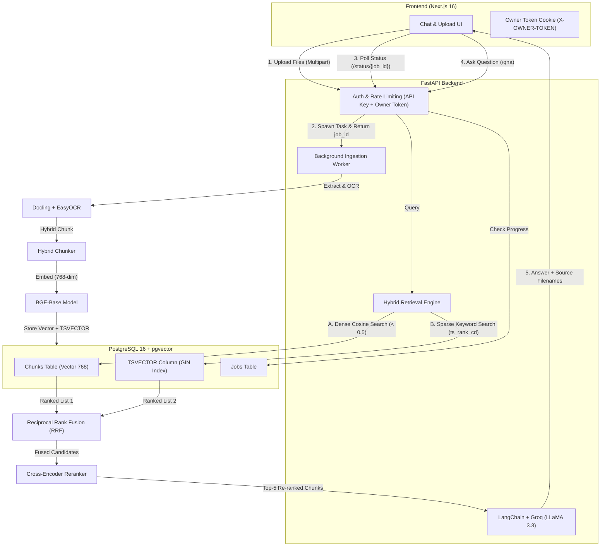
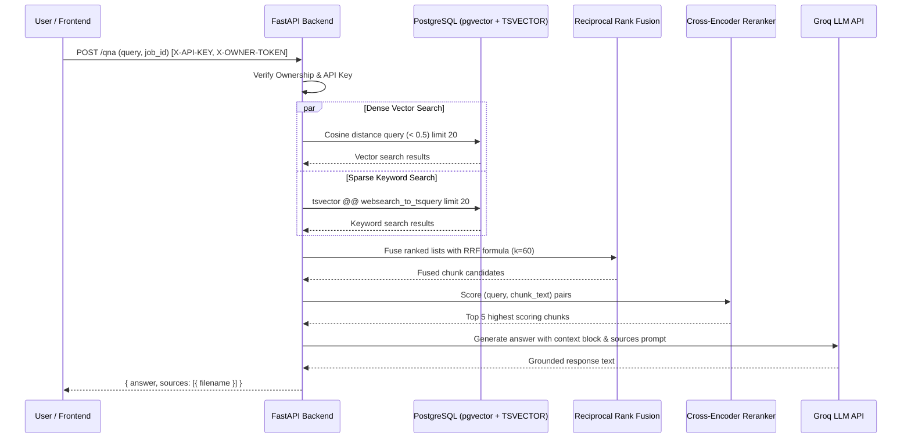
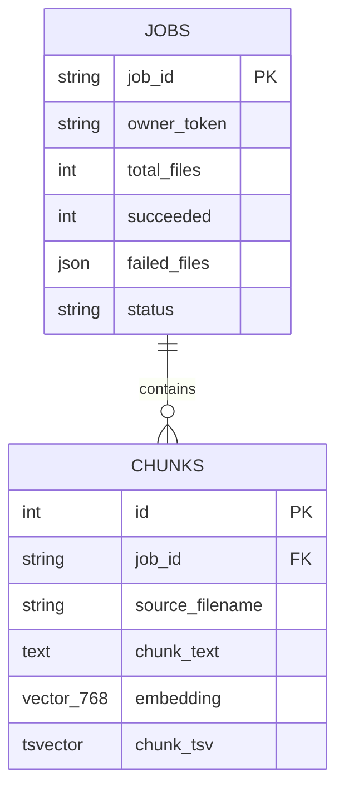

# Context Engine 🔍

> A high-performance, full-stack RAG engine featuring Hybrid Search (Dense Vector + Sparse Keyword TSVECTOR), Reciprocal Rank Fusion (RRF), Cross-Encoder Reranking, and Multi-Document Grounded Question Answering.

[](https://context-engine-alpha.vercel.app/)
[](https://github.com/Shreyansh-kushw/Context-Engine)
    


-F55036?style=flat-square)


**Context Engine** is an enterprise-grade, full-stack Retrieval-Augmented Generation (RAG) platform. It solves LLM hallucinations and information gaps by combining **Dense Semantic Vector Search** (`BAAI/bge-base-en-v1.5` via pgvector) and **Sparse Full-Text Keyword Search** (PostgreSQL `TSVECTOR` + GIN Index), merging candidate results through **Reciprocal Rank Fusion (RRF)**, and reranking passages with a **Cross-Encoder model** (`ms-marco-MiniLM-L6-v2`) before generating grounded answers with source citations using Groq.

---

## 🚀 Key Features

- **Hybrid Search (Dense + Sparse):** Combines semantic vector similarity search (`pgvector` cosine distance) with PostgreSQL full-text keyword search (`TSVECTOR` with GIN indexing and `ts_rank_cd`).
- **Reciprocal Rank Fusion (RRF):** Fuses ranking positions from both retrieval strategies ($RRF = \sum \frac{1}{k + r}$) to balance exact keyword hits and semantic concepts.
- **Cross-Encoder Neural Reranking:** Employs `cross-encoder/ms-marco-MiniLM-L6-v2` to score query-passage pairs directly, passing only the highest-relevance context to the LLM.
- **Multi-Document Ingestion & Background Processing:** Asynchronous background file processing with real-time job status tracking (`/status/{job_id}`).
- **OCR & Multi-Format Document Parsing:** Ingests PDFs (with automatic 10-page batching), plain text, and images (JPG, PNG, GIF, BMP, WEBP, TIFF) using Docling and EasyOCR.
- **Hybrid Semantic Chunking:** Tokenizer-aware document splitting that preserves document headings, paragraphs, and contextual hierarchy.
- **Source Citation & Attribution:** AI responses attribute facts back to the original documents, rendered as interactive citation badges in the chat UI.
- **Multi-Tenant Session & Security:**
  - **Owner Token Auth:** Auto-generated client tokens (`X-OWNER-TOKEN`) persisted in cookies to isolate user document sessions.
  - **API Key Guard:** `X-API-KEY` header authentication with rate limiting (`SlowAPI`) and payload size protection (25MB max).
- **Full-Stack Docker Compose:** One-command setup for PostgreSQL (with pgvector), FastAPI backend (with pre-cached models), and Next.js frontend.

---

## 🛠️ Tech Stack

### Backend
| Technology | Description | Version |
|---|---|---|
| **FastAPI** | High-performance async Python web framework | `>=0.136.3` |
| **PostgreSQL & asyncpg** | Async relational database with native vector & text search | `16` / `>=0.31.0` |
| **pgvector** | Vector similarity search extension for PostgreSQL | `>=0.4.2` |
| **SQLAlchemy 2.0 (Async)** | Async ORM with typed declarative models and computed columns | `>=2.0.50` |
| **SentenceTransformers** | Local 768-dim embeddings (`BAAI/bge-base-en-v1.5`) | `>=5.5.1` |
| **CrossEncoder** | Neural passage reranking (`cross-encoder/ms-marco-MiniLM-L6-v2`) | `>=5.5.1` |
| **Docling & EasyOCR** | Multi-format document parser, structure chunker, and OCR | `>=2.100.0` / `>=1.7.2` |
| **LangChain & Groq** | LLM orchestration and ultra-low latency generation | `>=1.3.9` / `>=1.1.3` |
| **SlowAPI** | Redis/in-memory rate limiting middleware | `>=0.1.10` |
| **Alembic** | Database migrations management | `>=1.18.4` |

### Frontend
| Technology | Description | Version |
|---|---|---|
| **Next.js** | React framework (App Router, Turbopack) | `^16.3.3` |
| **React** | UI Library | `^19.0.0` |
| **Tailwind CSS** | Styling & UI tokens | `^4.3.3` |
| **Lucide React** | Icons | `^1.16.0` |
| **React Markdown & Remark GFM** | AI response markdown rendering & citations | `^10.1.0` & `^4.0.1` |

---

## 🏗️ System Architecture



---

## 🧠 Retrieval Pipeline Details



---

## 🚦 Quick Start

### Prerequisites
- [Docker & Docker Compose](https://docs.docker.com/get-docker/) **(Recommended)**
- *Or for local development:* Python >= 3.12, Node.js >= 20, PostgreSQL with `pgvector`, and `uv`.
- A Groq API key from [console.groq.com](https://console.groq.com/keys).

---

### Method 1: One-Command Docker Compose (Recommended)

1. **Clone the repository:**
   ```bash
   git clone https://github.com/Shreyansh-kushw/Context-Engine.git
   cd Context-Engine
   ```

2. **Configure environment variables:**
   Create `.env` in the root folder:
   ```env
   DATABASE_URL=postgresql+asyncpg://postgres:postgrespassword@db:5432/context_engine
   DATABASE_URL_ALEMBIC=postgresql+psycopg://postgres:postgrespassword@db:5432/context_engine
   GROQ_API_KEY=gsk_your_groq_api_key_here
   GROQ_MODEL=llama-3.3-70b-versatile
   API_KEY=your_secure_api_key_here
   ```

   Create `frontend/.env.local`:
   ```env
   NEXT_PUBLIC_API_URL=http://localhost:8000
   API_KEY=your_secure_api_key_here
   ```

3. **Launch the stack:**
   ```bash
   docker compose up --build
   ```

4. **Run database migrations inside the backend container:**
   ```bash
   docker compose exec backend uv run alembic upgrade head
   ```

5. **Open [http://localhost:3000](http://localhost:3000)** in your browser!

---

### Method 2: Manual Local Development

#### 1. Database Setup
Make sure PostgreSQL is running locally and enable the vector extension:
```sql
CREATE DATABASE context_engine;
\c context_engine;
CREATE EXTENSION IF NOT EXISTS vector;
```

#### 2. Backend Setup
```bash
# Install dependencies with uv
uv sync

# Run database migrations
alembic upgrade head

# Start FastAPI development server
uv run uvicorn main:app --reload --port 8000
```
*Swagger docs available at [http://localhost:8000/docs](http://localhost:8000/docs).*

#### 3. Frontend Setup
```bash
cd frontend

# Install npm dependencies
npm install

# Start Next.js development server
npm run dev
```
*Frontend available at [http://localhost:3000](http://localhost:3000).*

---

## 📡 API Endpoints Reference

All endpoints require the `X-API-KEY` header and `X-OWNER-TOKEN` header.

| Method | Endpoint | Description | Rate Limit |
|---|---|---|---|
| `POST` | `/upload-files` | Upload documents and trigger async background ingestion | 5 / min |
| `GET` | `/status/{job_id}` | Check job ingestion status (`Processing`, `Success`, `Failed`) | — |
| `POST` | `/qna` | Query context engine for a specific `job_id` | 10 / min |

---

### Sample Requests

#### 1. Upload Documents
```bash
curl -X POST 'http://localhost:8000/upload-files' \
  -H 'X-API-KEY: your_api_key' \
  -H 'X-OWNER-TOKEN: owner_session_token' \
  -F 'files=@report.pdf' \
  -F 'files=@diagram.png'
```
**Response (200 OK):**
```json
{
  "job_id": "8f9a2c1e7b4d3a0f5e6d7c8b9a0f1e2d",
  "message": "Files uploaded successfully"
}
```

#### 2. Check Processing Status
```bash
curl -X GET 'http://localhost:8000/status/8f9a2c1e7b4d3a0f5e6d7c8b9a0f1e2d' \
  -H 'X-API-KEY: your_api_key' \
  -H 'X-OWNER-TOKEN: owner_session_token'
```
**Response (200 OK):**
```json
"Success"
```

#### 3. Ask Questions (Q&A)
```bash
curl -X POST 'http://localhost:8000/qna' \
  -H 'X-API-KEY: your_api_key' \
  -H 'X-OWNER-TOKEN: owner_session_token' \
  -H 'Content-Type: application/json' \
  -d '{
    "query": "What are the quarterly performance metrics?",
    "job_id": "8f9a2c1e7b4d3a0f5e6d7c8b9a0f1e2d"
  }'
```
**Response (200 OK):**
```json
{
  "answer": "According to the uploaded report, Q3 revenue increased by 24%...",
  "sources": [
    {
      "filename": "report.pdf"
    }
  ]
}
```

---

## 🗄️ Database Schema



---

## 📂 Project Directory Structure

```
Context-Engine/
├── app/
│   ├── database/             # Async database engine, session local & Base
│   ├── models/               # SQLAlchemy models (Chunks & Jobs)
│   ├── schema/               # Pydantic request & response schemas
│   ├── services/
│   │   ├── chunker.py        # Docling HybridChunker & HF Tokenizer
│   │   ├── embedder.py       # SentenceTransformers embedding generation
│   │   ├── reranker_service.py # Cross-Encoder reranking model
│   │   ├── llm_service.py    # LangChain prompt chain & Groq API client
│   │   └── pipelines.py      # Ingestion & Hybrid Retrieval pipelines
│   └── utils/
│       ├── auth.py           # APIKeyHeader & Owner token authentication
│       ├── config.py         # Pydantic Settings configuration
│       ├── file_validator.py # MIME type & file size validation
│       └── retrieval_utils.py # Reciprocal Rank Fusion (RRF) logic
├── frontend/
│   ├── app/                  # Next.js App Router (upload, chat, layout)
│   ├── components/           # UI components (chat bubbles, dropzone, aurora)
│   ├── lib/                  # API client, auth headers, cookies helpers
│   ├── dockerfile            # Multi-stage production Next.js Dockerfile
│   └── package.json          # Frontend dependencies
├── alembic/                  # Database migration versions
├── upload_files/             # Staging directory for incoming files
├── docker-compose.yml        # Full-stack Docker Compose configuration
├── dockerfile                # Backend container Dockerfile
├── pyproject.toml            # Python dependencies (uv)
└── uv.lock                   # Lockfile for reproducible Python builds
```

---

## 🎓 Engineering Decisions & What I Learned

Building Context Engine provided valuable insights into designing high-throughput, low-latency RAG architectures:

- **Hybrid Retrieval (Dense Semantic + Sparse Keyword):** Pure vector search often struggles with exact keyword lookups, acronyms, product IDs, or proper nouns. Combining `pgvector` cosine similarity with PostgreSQL's native Full-Text Search (`TSVECTOR` + GIN indexing with `ts_rank_cd`) ensures strong recall across both conceptual queries and exact term matches.
- **Reciprocal Rank Fusion (RRF):** Blending scores from different search mechanisms (e.g., cosine distance vs. BM25 / `ts_rank_cd`) is challenging because their raw score distributions are not directly comparable. RRF normalizes this by scoring candidates purely based on their ordinal rank positions ($RRF = \sum \frac{1}{k + r}$), yielding a robust, scale-invariant combined ranking.
- **Two-Stage Retrieval with Cross-Encoder Neural Reranking:** While bi-encoder embeddings (`BGE-base`) are fast for initial candidate retrieval, they compute query and document representations independently. Passing candidate chunks to a secondary Cross-Encoder model (`ms-marco-MiniLM-L6-v2`) evaluates cross-attention between query and passage tokens simultaneously, significantly improving precision and context quality for the LLM.
- **Embedded Vector Search with pgvector:** Storing 768-dimensional embeddings directly in PostgreSQL using `pgvector` eliminates the operational overhead of running a separate vector database while maintaining sub-millisecond retrieval speeds.
- **Exact vs. Approximate Search (Why No HNSW):** Approximate Nearest Neighbor (ANN) indexes like HNSW are ideal for global table scans, but unnecessary for tenant-scoped document retrieval. Because queries are already filtered by `job_id`, the search space is narrowed down to a small candidate set (tens to hundreds of chunks). Exact cosine distance calculation over this filtered subset executes in sub-milliseconds, provides 100% recall with zero approximation loss, and avoids the memory and write latency of building graph indexes during file ingestion.
- **Asynchronous Ingestion Workflows:** Decoupling heavy file ingestion (OCR, chunking, and embedding generation) into background tasks with a status polling endpoint ensures the API remains fast, non-blocking, and resilient.
- **Structure-Aware Chunking:** Retrieval quality is heavily determined by chunking strategy. Utilizing Docling with tokenizer-aware boundaries preserves semantic context and markdown hierarchy significantly better than naive fixed-character splits.
- **Async LLM Orchestration:** Leveraging `.ainvoke()` in LangChain and async SQLAlchemy sessions prevents event loop blocking, enabling high-concurrency request handling under load.

---

## 🛡️ License

This project is licensed under the [MIT License](LICENSE).